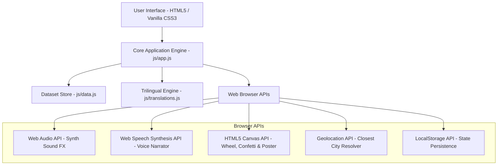

# 🍽️ CravePulse (Crave Plus) — Ultimate Gastronomy Discovery & Recommendation Engine

<p align="center">
  
</p>

<p align="center">
  <strong>Uncover legendary culinary masterpieces, heritage street foods, and iconic food capitals worldwide.</strong><br>
  <em>Personalized taste matching, physics-based flavor roulettes, guided chef cook-alongs, Swiggy & Zomato one-click ordering, and comprehensive nutrition tracking.</em>
</p>

<p align="center">
  <a href="https://crave-plus.vercel.app/"></a>
  
  
  
</p>

---

## 📑 Table of Contents

- [🌟 Overview](#-overview)
- [✨ Key Features & Capabilities](#-key-features--capabilities)
  - [1. 📍 Location-Scoped Smart Search & Eatery Radar](#1--location-scoped-smart-search--eatery-radar)
  - [2. 🛵 Direct Food Delivery Integration (Swiggy & Zomato)](#2--direct-food-delivery-integration-swiggy--zomato)
  - [3. 🟢 Pure Veg & 🔴 Non-Veg Dedicated Hub](#3--pure-veg--non-veg-dedicated-hub)
  - [4. 🎲 Physics-Based Craving Wheel (Flavor Roulette)](#4--physics-based-craving-wheel-flavor-roulette)
  - [5. ✨ AI Taste Matcher Quiz](#5--ai-taste-matcher-quiz)
  - [6. 🎁 3D Mystery Blind Box](#6--3d-mystery-blind-box)
  - [7. 📅 Daily Crave Meal Planner & Nutrition Tracker](#7--daily-crave-meal-planner--nutrition-tracker)
  - [8. ⚔️ Dish vs. Dish Battle Arena](#8-️-dish-vs-dish-battle-arena)
  - [9. 🏆 Gastronomy Passport & Milestone Badges](#9--gastronomy-passport--milestone-badges)
  - [10. 👨‍🍳 Interactive Guided Cook-Along Mode](#10--interactive-guided-cook-along-mode)
  - [11. 🖼️ Social Story Poster Generator (9:16 Canvas)](#11-️-social-story-poster-generator-916-canvas)
  - [12. 🛒 Smart Grocery Checklist & Export](#12--smart-grocery-checklist--export)
  - [13. 🎧 Web Audio FX & Speech Synthesis Narrator](#13--web-audio-fx--speech-synthesis-narrator)
  - [14. 🗺️ Curated Gastronomy Food Trails](#14-️-curated-gastronomy-food-trails)
  - [15. 💬 Foodie Community Tasting Notes & Reviews](#15--foodie-community-tasting-notes--reviews)
  - [16. ⚡ Floating Quick-Action Menu (FAB) & Shortcuts](#16--floating-quick-action-menu-fab--shortcuts)
- [🌐 Supported Food Capitals & Global Hubs](#-supported-food-capitals--global-hubs)
- [🎨 Design System & Visual Identity](#-design-system--visual-identity)
- [🛠️ Architecture & Technology Stack](#️-architecture--technology-stack)
- [📂 Project Directory Structure](#-project-directory-structure)
- [⌨️ Keyboard Shortcuts](#️-keyboard-shortcuts)
- [🌍 Multilingual & Localization Architecture](#-multilingual--localization-architecture)
- [🚀 Getting Started Locally](#-getting-started-locally)
- [☁️ Deployment Guide](#️-deployment-guide)
- [🔒 Data Privacy & Offline Capabilities](#-data-privacy--offline-capabilities)
- [🤝 Contributing & Adding New Delicacies](#-contributing--adding-new-delicacies)
- [📝 License & Acknowledgements](#-license--acknowledgements)

---

## 🌟 Overview

**CravePulse (Crave Plus)** is a high-performance, responsive single-page web application engineered to turn the everyday dilemma of *"What should I eat today?"* into an engaging, gamified exploration. 

Whether craving spicy Hyderabadi Dum Biryani, Mumbai Vada Pav, Tokyo Tonkotsu Ramen, Roman Carbonara, or artisanal Parisian croissants, CravePulse provides instant regional recommendations, culinary backstories, nutritional breakdowns, step-by-step cooking timers, authentic eatery locations, and deep-linked food delivery ordering.

---

## ✨ Key Features & Capabilities

### 1. 📍 Location-Scoped Smart Search & Eatery Radar
- **GPS-Assisted Food Hub Detection**: One-click geolocation detection automatically resolves your closest culinary capital (using the Haversine formula) across 21+ global destinations.
- **Location-Aware Autocomplete**: Instant search overlay filtering dishes available in your active city or globally with highlighted cuisine tags, price estimates, and direct keyboard navigation (`↑`, `↓`, `Enter`).
- **Live Eatery Radar**: In-depth modal showcasing iconic local spots serving each dish, approximate distance, open status, signature variants, and direct Google Maps navigation.

### 2. 🛵 Direct Food Delivery Integration (Swiggy & Zomato)
- **Deep-Linked Pre-Searches**: Seamlessly launches **Swiggy** and **Zomato** with pre-populated dish and city search queries for immediate doorstep ordering.
- **Dedicated Quick Delivery Picker Modal**: Tap the delivery action button on any dish card to review delivery estimates (25–35 min), live GPS tracking details, and choose between leading delivery apps.

### 3. 🟢 Pure Veg & 🔴 Non-Veg Dedicated Hub
- **Prominent Color-Coded Toggles**:
  - **All Dishes**: Comprehensive global menu.
  - **Pure Veg 🟢**: Emerald green theme filtering 100% vegetarian culinary items.
  - **Non-Veg 🔴**: Ruby red theme filtering authentic meat, poultry, and seafood delicacies.
- **FSSAI Dot Standard Indicators**: Clear green and red boxed dot badges on every dish thumbnail, card header, and detail view.

### 4. 🎲 Physics-Based Craving Wheel (Flavor Roulette)
- **HTML5 Canvas Roulette**: Custom physics-based spinning wheel with deceleration curves, dynamic audio click ticks, and celebratory audio chimes upon landing.
- **Location-Filtered Slices**: Dynamically selects dishes from your currently selected city or active dietary filters.
- **Instant Decision Card**: Presents the winning dish with immediate ordering, saving, and recipe view actions.

### 5. ✨ AI Taste Matcher Quiz
- **4-Stage Flavor Assessment**:
  1. *Flavor Atmosphere*: Comfort Soul Food, Fiery & Bold, Fresh & Crisp, or Luxurious Dining.
  2. *Texture & Sensory Profile*: Crispy & Crunchy, Rich & Velvety, Steaming Broth, or Sweet & Silky.
  3. *Meal Timing & Portion*: Light Breakfast, Feasting Lunch, Late Night Street Munchies, or Anytime Treat.
  4. *Dietary Preference*: 100% Pure Vegetarian, High-Protein Meat Feast, Seafood Catch, or Vegan Friendly.
- **Soulmate Match Algorithm**: Scores all database dishes against selected parameters and reveals the top 3 best-matched culinary recommendations.

### 6. 🎁 3D Mystery Blind Box
- **Interactive 3D Gift Box**: CSS 3D perspective transforms with a floating ribbon lid animation.
- **Confetti Particle Engine**: Full-screen physics-based canvas confetti explosion upon unboxing a randomized mystery delicacy.

### 7. 📅 Daily Crave Meal Planner & Nutrition Tracker
- **4 Meal Slots**: Breakfast (07:00–10:30 AM), Lunch (12:30–03:30 PM), Dinner (07:30–10:30 PM), and Tea Time / Snacks.
- **Real-Time Macro Counters**:
  - Total Calories with progressive calorie bar towards a 2,000 kcal baseline.
  - Protein ($g$), Carbohydrates ($g$), and Healthy Fats ($g$) distribution.
  - Estimated daily food budget tracker ($\text{₹}$).
- **Single-Click Day Grocery Export**: Merges all ingredients across the 4 planned meals into an organized grocery shopping list.

### 8. ⚔️ Dish vs. Dish Battle Arena
- **Head-to-Head Comparison Matrix**: Compare calories, prep time, spice index, protein/macro profile, pricing, and origin between any two delicacies.
- **Curated Classic Showdowns**:
  - *Hyderabadi Dum Biryani vs. Kolkata Biryani*
  - *Mumbai Vada Pav vs. Pav Bhaji*
  - *Roman Carbonara vs. Cacio e Pepe*
  - *Tokyo Tonkotsu Ramen vs. Vietnamese Pho Bo*
  - *Mexican Birria Tacos vs. Bangkok Pad Thai*
- **Live Community Voting**: Vote for your favorite contender with instant percentage breakdown and persistent vote storage.

### 9. 🏆 Gastronomy Passport & Milestone Badges
- **Culinary Level Progression**: Advance your rank from *Street Rookie* (Level 1) to *Epicurean Master* (Level 5) as you check off dishes.
- **City Visas & Stamps**: Earn passport stamps for each culinary capital explored.
- **6 Achievement Badges**:
  - 👑 *Street Food Connoisseur* (Tasted 5+ street specialties)
  - 🌶️ *Spice Explorer* (Tasted 3+ fiery dishes)
  - 🍨 *Sweet Tooth* (Tasted 3+ artisanal desserts)
  - 🌍 *Global Voyager* (Explored dishes across 4+ cities)
  - 👨‍🍳 *Master At-Home Chef* (Completed 3+ cook-along sessions)
  - 📝 *Food Critic* (Posted 3+ community tasting reviews)

### 10. 👨‍🍳 Interactive Guided Cook-Along Mode
- **Step-by-Step Culinary Walkthrough**: Guided phases (*Mise en Place*, *Sauté & Infusion*, *Simmer / Dum*, *Garnish & Plating*).
- **Circular SVG Countdown Timer**: Interactive start, pause, and reset controls for each step's cooking time.
- **Dynamic Serving Scaler**: Multipliers ($1\times$, $2\times$, $4\times$) that adjust ingredient quantities in real time.
- **Speech Synthesis Voice Guide**: Reads preparation instructions aloud hands-free.

### 11. 🖼️ Social Story Poster Generator (9:16 Canvas)
- **High-Resolution Graphics Engine**: Renders $540 \times 960\text{px}$ vertical story graphics via HTML5 Canvas.
- **4 Visual Color Themes**: *Radiant Obsidian*, *Emerald & White Luxe*, *Ruby Berry Crimson*, and *Royal Saffron Gold*.
- **Customizable Foodie Quotes**: Add your personal rating or quote, then download the PNG or copy directly to clipboard.

### 12. 🛒 Smart Grocery Checklist & Export
- **Organized Ingredient Checklists**: Interactive item checkboxes for at-home cooking.
- **Clipboard & Print Support**: One-tap copy to clipboard formatted for WhatsApp/SMS or direct browser printing.

### 13. 🎧 Web Audio FX & Speech Synthesis Narrator
- **Audio Synthesizer (Web Audio API)**: Harmonic frequency-generated audio feedback for clicks, drawer actions, timer alerts, and wheel spinning without external audio asset downloads.
- **Audio Storyteller (Web Speech API)**: Multi-lingual voice narrator reciting dish origins, historical backstories, and regional pronunciations.

### 14. 🗺️ Curated Gastronomy Food Trails
- **Full-Day Crawl Itineraries**: Handcrafted culinary itineraries per city (e.g., *Hyderabad Royal Nizami Heritage Trail*, *Mumbai Coastal Street Trail*, *Tokyo Ramen & Izakaya Crawl*, *Rome Eternal Pasta Walk*).
- **Time, Walking Distance, and Budget Estimates**: Route maps, stop sequences, and signature item highlights.

### 15. 💬 Foodie Community Tasting Notes & Reviews
- **Interactive Review Submission**: Submit ratings ($1\text{–}5\star$), author tags, and flavor notes saved to `localStorage`.
- **Pre-loaded Tasting Notes**: Curated verified reviews for every dish in the database.

### 16. ⚡ Floating Quick-Action Menu (FAB) & Shortcuts
- **Radial Speed Dial**: Quick floating menu to launch the Craving Wheel, Quiz, Meal Planner, Blind Box, Battle Arena, Passport, or return to top.
- **Keyboard Navigation**: Global keyboard shortcuts for power users.

---

## 🌐 Supported Food Capitals & Global Hubs

| Region | Cities & Food Capitals | Signature Delicacies |
| :--- | :--- | :--- |
| 🇮🇳 **India** | **Hyderabad**, **Mumbai**, **Delhi**, **Bengaluru**, **Kolkata**, **Chennai**, **Lucknow**, **Amritsar** | Dum Biryani, Haleem, Vada Pav, Pav Bhaji, Butter Chicken, Chole Bhature, Crispy Masala Dosa, Kathi Rolls, Rasgulla, Awadhi Kebabs, Amritsari Kulcha |
| 🇯🇵 **East Asia** | **Tokyo**, **Osaka**, **Seoul** | Tonkotsu Ramen, Nigiri Sushi, Takoyaki, Okonomiyaki, Korean Fried Chicken, Tteokbokki, Bulgogi |
| 🇹🇭 🇻🇳 🇸🇬 **SE Asia** | **Bangkok**, **Hanoi**, **Singapore** | Pad Thai, Tom Yum Goong, Vietnamese Pho Bo, Banh Mi, Hainanese Chicken Rice, Chili Crab |
| 🇮🇹 🇫🇷 🇪🇸 **Europe** | **Rome**, **Paris**, **Barcelona** | Spaghetti Carbonara, Artisanal Gelato, Butter Croissant, Beef Bourguignon, Seafood Paella, Churros con Chocolate |
| 🇺🇸 🇲🇽 **Americas** | **New York**, **Oaxaca** | NY Style Pizza, Pastrami on Rye, Birria Tacos, Guacamole & Mole |
| 🇹🇷 🇱🇧 **Middle East** | **Istanbul**, **Beirut** | Doner Kebab, Pistachio Baklava, Mezze Platter, Falafel & Shawarma |

---

## 🎨 Design System & Visual Identity

CravePulse is crafted with a clean **Pure White, Emerald Green 🟢, and Ruby Red 🔴** visual aesthetic, with an obsidian dark theme.

```
CSS Design Tokens
├── --bg-primary: #ffffff              (Crisp pure white surface)
├── --bg-card: rgba(255, 255, 255, 0.94) (Glassmorphism backdrop)
├── --emerald: #10b981                 (Pure Veg indicator & wellness accent)
├── --emerald-dark: #059669            (Primary interactive button tone)
├── --ruby: #e11d48                    (Non-Veg indicator & fiery craving tone)
├── --amber: #f59e0b                   (Rating stars, badges & golden highlights)
├── --text-primary: #0f172a            (Deep slate text contrast)
└── --font-sans: 'Outfit', 'Plus Jakarta Sans', 'Syne', sans-serif
```

- **Micro-Animations**: Smooth cubic-bezier transitions, pulsing live status dots, steam particles, and active hover elevation.
- **Glassmorphism**: Backdrop blur (`backdrop-filter: blur(16px)`) with subtle ambient glowing background mesh orbs.
- **Responsive Layout**: Fluid CSS Grid and Flexbox adapting across mobile ($320\text{px}$), tablets ($768\text{px}$), laptops ($1024\text{px}$), and $4\text{K}$ screens.

---

## 🛠️ Architecture & Technology Stack



- **Frontend**: Semantic HTML5, Vanilla JavaScript (Modern ES6+ Modules / IIFE pattern).
- **Styling**: Vanilla CSS3 with CSS Custom Properties, Glassmorphism, CSS Grid & Flexbox (No heavy CSS framework overhead).
- **Icons**: Lucide Icons vector library.
- **Audio Engine**: Native `AudioContext` Web Audio API oscillator synthesis.
- **Storage**: Zero-database client-side persistence with `localStorage`.
- **Zero Build Step**: Runs directly in any web browser without required compilation or bundler steps.

---

## 📂 Project Directory Structure

```
crave-plus/
├── index.html              # Main single-page application structure & interactive modals
├── README.md               # Comprehensive project documentation
├── css/
│   └── style.css           # Design tokens, layouts, glassmorphic styles & dark mode
└── js/
    ├── data.js             # Comprehensive dataset: cities, dishes, trails, battles & badges
    ├── translations.js     # Trilingual dictionary (English, Telugu, Hindi)
    └── app.js              # Application logic, audio engine, canvas & event handlers
```

---

## ⌨️ Keyboard Shortcuts

| Shortcut | Action |
| :--- | :--- |
| <kbd>Ctrl</kbd> + <kbd>K</kbd> / <kbd>Cmd</kbd> + <kbd>K</kbd> | Focus global dish & city search bar |
| <kbd>↑</kbd> / <kbd>↓</kbd> | Navigate autocomplete search suggestions |
| <kbd>Enter</kbd> | Select active autocomplete suggestion |
| <kbd>Escape</kbd> | Close any active modal, drawer, or dropdown menu |

---

## 🌍 Multilingual & Localization Architecture

CravePulse features built-in trilingual localization across:
- 🇬🇧 **English (`en`)**
- 🇮🇳 **తెలుగు / Telugu (`te`)**
- 🇮🇳 **हिन्दी / Hindi (`hi`)**

### Adding New Translation Strings
To add or modify localized keys, update [translations.js](file:///c:/Users/charan/Desktop/crave%20plus/js/translations.js):

```javascript
// Example addition in js/translations.js
const TRANSLATIONS = {
  en: { custom_key: "Discover Flavors" },
  te: { custom_key: "రుచులను కనుగొనండి" },
  hi: { custom_key: "स्वादों की खोज करें" }
};
```

All elements with `data-i18n="custom_key"` automatically update whenever the user toggles languages.

---

## 🚀 Getting Started Locally

### Prerequisites
- Any modern web browser (Google Chrome, Microsoft Edge, Mozilla Firefox, Safari, Brave).
- Optional: Lightweight HTTP server (Python, Node.js, or VS Code Live Server).

### Quick Setup

1. **Clone the repository**:
   ```bash
   git clone https://github.com/your-username/crave-plus.git
   cd crave-plus
   ```

2. **Launch a local server**:
   - **Using Python 3**:
     ```bash
     python -m http.server 8080
     ```
   - **Using Node.js (`npx serve`)**:
     ```bash
     npx serve .
     ```
   - **Using VS Code**: Right-click `index.html` $\rightarrow$ **Open with Live Server**.

3. **Access the application**:
   Open [http://localhost:8080](http://localhost:8080) in your browser.

---

## ☁️ Deployment Guide

### Deploying to Vercel
1. Push your repository to **GitHub / GitLab / Bitbucket**.
2. Go to [Vercel Dashboard](https://vercel.com/) and click **Add New Project**.
3. Select your `crave-plus` repository.
4. Keep the default settings (Framework Preset: *Other*, Root Directory: `./`).
5. Click **Deploy**. Your site will be live instantly with global CDN caching and free HTTPS!

### Deploying to GitHub Pages
1. In your GitHub repository, navigate to **Settings** $\rightarrow$ **Pages**.
2. Under **Build and deployment** $\rightarrow$ **Source**, choose `Deploy from a branch`.
3. Select `main` / `root` and click **Save**.

---

## 🔒 Data Privacy & Offline Capabilities

- **Zero User Tracking**: No external analytics tracking or personal data harvesting.
- **Client-Side Storage**: All favorites, tasted dish logs, meal plans, custom reviews, and battle arena votes are stored locally on your device via `localStorage`.
- **Audio Privacy**: Audio narration uses browser-native speech synthesis without transmitting recordings over the network.

---

## 🤝 Contributing & Adding New Delicacies

Contributions are always welcome! To add your city's famous regional dishes:

1. Fork the repository.
2. Open [`js/data.js`](file:///c:/Users/charan/Desktop/crave%20plus/js/data.js).
3. Add your dish object following this schema:

```javascript
{
  id: "dish-unique-slug",
  name: "Authentic Dish Name",
  nativeName: "స్థానిక పేరు / स्थानीय नाम",
  cityId: "hyderabad",
  category: "lunch", // "breakfast" | "lunch" | "dinner" | "snack" | "dessert" | "street"
  diet: "veg",       // "veg" | "non-veg"
  spiceLevel: 2,     // 0 (Zero) to 4 (Fiery)
  rating: 4.9,
  ratingCount: "18k+",
  price: "₹240",
  calories: 450,
  macros: { protein: "18g", carbs: "52g", fat: "14g" },
  description: "Authentic description and historical culinary story.",
  hack: "Secret foodie hack on how to best enjoy this dish.",
  image: "https://images.unsplash.com/...",
  ingredients: ["Ingredient 1", "Ingredient 2", "Ingredient 3"],
  recipeSummary: "Brief description of preparation method.",
  places: [
    { name: "Famous Restaurant Name", area: "Neighborhood", distance: "2.4 km", mapsQuery: "Query" }
  ]
}
```

4. Submit a **Pull Request** with a brief summary of your additions.

---

## 📝 License & Acknowledgements

- **License**: Released under the [MIT License](LICENSE). Free for personal, commercial, and educational use.
- **Imagery**: High-resolution photography sourced via [Unsplash](https://unsplash.com/) and [Wikimedia Commons](https://commons.wikimedia.org/).
- **Icons**: Designed by the [Lucide Icons](https://lucide.dev/) team.
- **Typography**: [Google Fonts](https://fonts.google.com/) (*Outfit*, *Plus Jakarta Sans*, and *Syne*).

---

<p align="center">
  Made with ❤️ for food lovers, culinary travelers, and home chefs worldwide.<br>
  <strong>Bon Appétit! • బాగుంది! • स्वादिष्ट भोजन!</strong>
</p>
